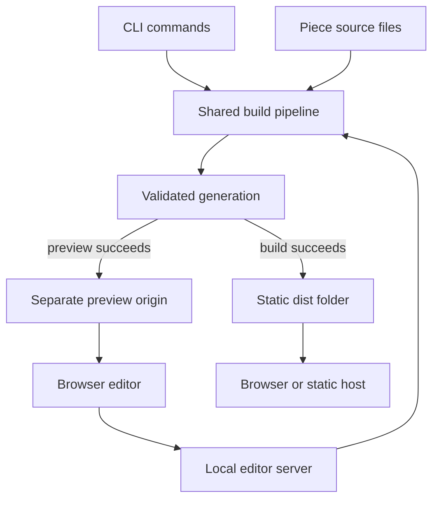

# Architecture

[README](../README.md) · [Installation](INSTALLATION.md) · [User manual](USER_MANUAL.md) · [Licensing](LICENSING.md)

This document describes the implemented Papeleria 0.1.0 release candidate, with schema 1, as reviewed on 30 September 2026. It is a standalone technical reference for maintainers and integrators. Paths below are relative to the repository root unless identified as piece-relative. The repository is [JeremiahJRRoss/papeleria](https://github.com/JeremiahJRRoss/papeleria); `main` is its default branch.

## System boundaries

Papeleria is a local TypeScript/Node.js application with three entry surfaces: the CLI, the browser source editor, and generated static publications. A piece's manifest, Markdown, CSV, and media are the source of truth. The filesystem supplies persistence. There is no database, account service, hosted backend, telemetry pipeline, or upload service.

The same build pipeline serves CLI Check/Build and editor Check/Preview/Build. Published output carries local resources and works from `file://` or ordinary static hosting. A document publishes no JavaScript; a deck publishes one classic script; a comic publishes one script containing its reader and the pinned page-turn engine. Preview-only scripts do not enter the publication.

## Repository and components

The application root is the repository root; npm commands run there.

| Path | Responsibility |
| --- | --- |
| [`src/cli`](https://github.com/JeremiahJRRoss/papeleria/tree/main/src/cli) | Parse the five commands, select targets, print human/JSON results, and map exit codes |
| [`src/core`](https://github.com/JeremiahJRRoss/papeleria/tree/main/src/core) | Load bounded inputs; parse manifests, Markdown, CSV, SVG, video; resolve content; validate schemas/paths; create image derivatives and chart SVG |
| [`src/checks`](https://github.com/JeremiahJRRoss/papeleria/tree/main/src/checks) | Run source/output rules and preserve source locations for findings |
| [`src/build`](https://github.com/JeremiahJRRoss/papeleria/tree/main/src/build) | Snapshot inputs; stage generations; render, measure, validate, report, recover, and promote output |
| [`src/server`](https://github.com/JeremiahJRRoss/papeleria/tree/main/src/server) | Loopback HTTP, editor sessions, file saves, watchers, event streams, and isolated preview generations |
| [`src/editor`](https://github.com/JeremiahJRRoss/papeleria/tree/main/src/editor) | CodeMirror source editing, diagnostics, dirty buffers, revision conflicts, and preview coordination |
| [`templates`](https://github.com/JeremiahJRRoss/papeleria/tree/main/templates) | Deck, comic, and document schemas, renderers, styles, clients, and sample pieces; shared block/schema definitions |
| [`theme`](https://github.com/JeremiahJRRoss/papeleria/tree/main/theme) | Local design tokens, styles, fonts, and distribution identity |
| [`vendor/page-flip`](https://github.com/JeremiahJRRoss/papeleria/tree/main/vendor/page-flip) | Pinned StPageFlip engine and MIT license |
| [`scripts`](https://github.com/JeremiahJRRoss/papeleria/tree/main/scripts) | Client bundling, package preparation, inventory/brand/schema/string checks, and installers |
| [`test`](https://github.com/JeremiahJRRoss/papeleria/tree/main/test) | Unit, integration, browser, and packaging checks |
| [`installers`](https://github.com/JeremiahJRRoss/papeleria/tree/main/installers) | User-level installers, launcher, uninstallers, and pinned runtime checksums |

### Principal technologies

| Technology | Use |
| --- | --- |
| Node.js 22, TypeScript, ESM | CLI, filesystem operations, local servers, typed content model |
| YAML parser, Ajv 8 | YAML/JSON loading and JSON Schema 2020-12 validation |
| markdown-it and footnote extension | Markdown rendering with Papeleria's escaping and linking restrictions |
| D3 modules | Build-time chart scales, shapes, and formatting; charts are emitted as SVG |
| sharp | Native raster inspection and WebP/optional AVIF generation |
| saxes and bounded media inspection | Restricted SVG parsing and video container validation |
| CodeMirror 6, Lezer, schema assistance | Browser source editor |
| esbuild | Browser bundle construction |
| html-validate, Node test runner, Playwright | Output validation and automated verification |

The lockfile determines actual versions. `npm pack` creates an `npm-shrinkwrap.json` from that lock so a tarball installation uses the same dependency tree; the temporary shrinkwrap is removed from the checkout afterward. Native dependencies are platform-specific. Their obligations are described in [Licensing](LICENSING.md#release-status-and-native-dependencies).

## Data model and contracts

A piece has one manifest, common metadata, a template discriminator, and an ordered template-specific collection. All three use the same reusable content definitions.

| Entity | Main relationship and invariant |
| --- | --- |
| Piece | Exactly one manifest; `schema: 1`; `template` chooses deck, comic, or document |
| Deck | Ordered nonempty `slides`; layout decides required/forbidden slide fields |
| Slide | Required layout/title; columns, chart/table, image, attributes, or swatches only where supported |
| Comic | Ordered nonempty `pages` |
| Page | Art path and alt text; optional ordered panels, credit, and rights |
| Panel | In-bounds percentage rectangle, transcript, and at most one detail form |
| Document | Ordered nonempty `sections` |
| Section | Plain heading, optional logical page break, nonempty block list |
| Block | Exactly one of text, image, video, chart, table, quote, note, callout, or logo |
| Asset reference | Validated piece-relative path with a type-specific allowed folder/extension |
| Finding | Rule, severity, message/fix, real source location when known, optional related location |
| Source target | Associates source ranges with rendered slides, sections, pages, or panels for navigation |

The [user manual](USER_MANUAL.md) contains the complete author-facing field reference and input constraints. Internally, loading retains source positions, validation applies structural rules, and resolution produces typed content that renderers can consume without reparsing. Schema checks alone are insufficient: file existence, geometry sums, CSV values, media decoding, output links, and budgets require semantic or generated-output checks.

Unknown fields are rejected. All supplied text must contain visible content. No manifest field permits arbitrary template code, raw HTML execution, or remote resource fetching. A schema version newer than the tool supports yields a specific compatibility finding rather than being interpreted as version 1.

## Build lifecycle

1. For a publication build, acquire the piece's build lock and recover any interrupted output promotion.
2. Open a source snapshot with bounded readers. Record every read source's byte revision using SHA-256; editor preview/check can overlay unsaved text.
3. Load and validate the manifest, resolve Markdown/data/media references, and compute charts. Preserve findings and their positions even if an earlier phase prevents complete resolution.
4. Run source rules. If they pass, create a generation under `.papeleria/staging/`.
5. Generate media, copy required originals/video and tool assets, render HTML, generate scoped third-party notices, calculate weight, and run HTML/resource/link/brand output rules.
6. Settle findings into one report. On failure, discard the candidate. Check discards successful output as well; Preview retains a successful generation for its separate origin.
7. For an eligible Build, recheck all source revisions, then promote the completed generation to `dist/`. A withheld piece is validated without publication.

Targets are `dist`, `check`, and `preview`. A preview is first validated as published output, then receives its preview bridge. Therefore the editor's instrumentation does not distort the publication's weight or script limits. Superseded work can be canceled between pipeline stages.

### Output integrity and limits

A content error yields exit 1. Usage, I/O, or tool failures yield exit 2 with a stable error code; successful warning-only checks and withheld builds exit 0. Source changes yield `E_SOURCE_CHANGED`; simultaneous publication builds yield `E_BUSY`.

Output is staged before promotion. Replacement uses recoverable filesystem renames, with information retained for the next build to restore an interrupted transaction. This avoids serving a half-built generation, but it is not a claim that every filesystem provides a single atomic swap with no transient pathname gap. Keep `.papeleria/` after an interrupted promotion until recovery runs.

Budgets use deterministic file selection at three viewports, uncompressed bytes, and the worst supported image-format path. They are reproducible accounting rules, not measured end-user network performance. The current limits and included assets are in the [manual](USER_MANUAL.md#output-budgets). Native encoder/platform changes can change binary output sizes even when author source is unchanged; do not assume bit-identical cross-platform builds.

## Local editor and preview isolation

Edit runs two HTTP origins, both bound to `127.0.0.1`:

| Origin | Exposes | Excludes |
| --- | --- | --- |
| Editor | Tool-owned UI; authenticated piece/file/check/build APIs; event stream | Arbitrary filesystem access and unauthenticated saves |
| Preview | Read-only generated files under generation-specific URLs | Editor API, source-file save access, or arbitrary files |

Requests validate the expected Host and Origin. The editor launches with a random one-time token in the URL fragment, expiring after two minutes. A same-origin `POST /api/session` exchanges it for the session token and a one-time resume token. The session token remains in page memory; the resume token is kept in that tab's session storage and rotated on use. Subsequent API calls carry `X-Papeleria-Token`. Event streaming uses authenticated fetch rather than putting the token in a query string.

Preview frame messages are accepted only from the expected origin/window and current generation. Content Security Policy, source escaping, strict URL checks, restricted SVG, and path confinement constrain authored content. The separate preview origin keeps generated content away from editor privileges. These controls do not protect against malware or an attacker already able to act as the same operating-system user.

The editor is a local application, not a network collaboration server. Do not expose its port through a public proxy or assume the API is a stable integration service.

### Internal routes

These describe the current editor implementation; the CLI and manifest are the supported authoring surfaces.

| Method and route | Purpose |
| --- | --- |
| `POST /api/session` | Redeem a launch or resume token, with exact editor Origin |
| `GET /api/piece` | Piece metadata/file overview |
| `GET /api/file` | Read an allowed file and revision |
| `PUT /api/file` | Save content against `expectedRevision` |
| `POST /api/preview` | Build a preview from the manifest and permitted Markdown overlays |
| `POST /api/check` | Validate the same overlay snapshot |
| `POST /api/build` | Build saved source against expected revisions |
| `GET /api/events` | Authorized change/status event stream |

Request objects reject unknown fields. JSON request bodies are bounded at 10 MiB; manifests at 1 MiB; editable text buffers at 5 MiB; overlays at 50. A revision is a lowercase 64-character SHA-256 hex string. Build revision maps are bounded. Malformed and over-limit bodies produce explicit client errors.

### Editing and concurrency

The UI debounces preview requests and assigns request/generation identifiers so older responses cannot overwrite newer state. It submits the manifest plus dirty Markdown overlays, preserving disk files until Save. Check can use overlays; Build requires clean buffers and reads saved files. A failed preview retains and dims the last good generation.

Saving checks the expected disk revision, writes a replacement, and retains ten backups per file. Byte order marks and line-ending conventions are preserved. Papeleria coordinates its own editors' saves and detects intervening edits, but a noncooperating external writer can race the final replacement. This is optimistic file concurrency, not a transactional multiuser document database.

Serve reuses the pipeline and separate preview origin, but operates on saved files only. Its shell and read-only event stream have no edit API or session token; Host/Origin restrictions still apply. Failed rebuilds preserve the last good preview. Neither Serve nor Edit Preview publishes to `dist/`.

## Persistence and privacy

| Location | Contents | Lifetime |
| --- | --- | --- |
| Piece source | Manifest, Markdown, CSV, and original media | User-owned source; back up independently |
| Piece `dist/` | Static publication and scoped notices | Replaced only by an eligible successful build |
| Piece `.papeleria/` | Media cache, staging, preview generations, save backups, recovery data | Generated working state, with recoverable user data in backups/transactions |
| Per-user state directory | Secret signing key for image-cache metadata | Recreated if removed; deleting it invalidates prior signed cache trust |
| Browser memory | Session token and unsaved editor buffers | Lost when the page closes/reloads |
| Tab session storage | One-time editor resume token | Tab/session scoped; not a saved document buffer |

The cache key lives outside the piece so a copied piece cannot bring its own trusted cache key. Reuse requires valid signed metadata and matching inputs; an untrusted/imported cache is regenerated. The OS-specific state paths and `PAPELERIA_STATE_HOME` override are in [Installation](INSTALLATION.md#update-and-remove).

Published output contains rendered text, speaker notes, transcripts, and needed assets. Hiding a note or panel detail in the UI is not a confidentiality boundary. Ordinary raster derivatives remove metadata, while copied video and zoom originals can retain it. No remote font/CDN loading is required by generated pages; user-authored outbound links still lead to external destinations when activated.

## Development and verification

From the repository root, install with `npm ci`. The following commands are defined by the current package:

| Command | Purpose |
| --- | --- |
| `npm run build` | Compile server/CLI and client TypeScript, then bundle clients |
| `npm run typecheck` | Check application, client, and browser-test types |
| `npm test` | Build and run Node unit/integration tests |
| `npm run test:browser` | Build application/browser tests and run browser behavior checks |
| `npm run test:package` | Build and exercise packed installation/output behavior |
| `npm run examples` | Build the bundled example pieces |
| `npm run check:schema-defs` | Check shared schema consistency |
| `npm run check:strings` | Check localized string coverage |
| `npm run check:brand` | Check distribution identity/brand boundaries |
| `npm run check:licenses` | Check retained dependency/license inventory |
| `npm run check:licenses:release` | Apply the stricter release license gate, including unresolved native reviews |
| `npm pack` | Make an installable npm tarball with pinned shrinkwrap |
| `npm run package:installers` | Build and create installer ZIP/tarball under repository-root `release/` |

Browser tests require the matching Playwright browser binaries. With dependencies installed, `npx playwright install chromium firefox webkit` downloads them; on a managed machine arrange any required OS libraries through its normal administration process. Browser-specific test selection is defined by the checked-in test harness/CI rather than by a public CLI option.

Tests cover parsing/locations, paths and hostile content, media/data limits, rendering/output checks, budgets, promotion recovery, save conflicts, session boundaries, reader behavior, and packaging. This documentation review checked source contracts and examples; it does not assert a fresh execution of the full application suite or native-platform installers.

### Release readiness

The implementation is a working release candidate. Before declaring a general release, maintainers still need recorded native-platform/browser acceptance, screen-reader and native Spanish review, unfamiliar-user/performance sessions, and resolution of the native redistribution obligations. Manual page-turn/reduced-motion edges also remain subject to acceptance. The current package remains private until release ownership, registry naming, and publication are settled. Generating an installer ZIP does not complete those gates.

## Extending Papeleria

Changes to a field or content type usually cross several components. Update its schema, TypeScript model/resolution, source-location handling, renderer, diagnostics, editor help, examples, and this manual together. Add a targeted test for the user-visible behavior and a rejection test for invalid data where the boundary changes. Preserve schema-1 compatibility or introduce an explicit new schema version.

For a new template, register its schema/renderer/sample, define its source targets and output budget, implement its published and preview behavior, and exercise offline output and print. Keep published script/resource restrictions explicit. For a new language, add every published string and check the result with a fluent reviewer. For a new dependency, update the lockfile, retained license inventory, bundling/distribution scope, and native review where applicable.

Current deliberate limits include fixed chart types/palette, no arbitrary HTML or plugin execution from a piece, no media transcoding, no physical document page totals, no hosted collaboration, and no automatic deployment. These are product boundaries that an extension must address explicitly, rather than implied capabilities of the existing architecture.
