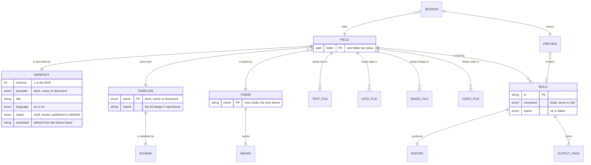
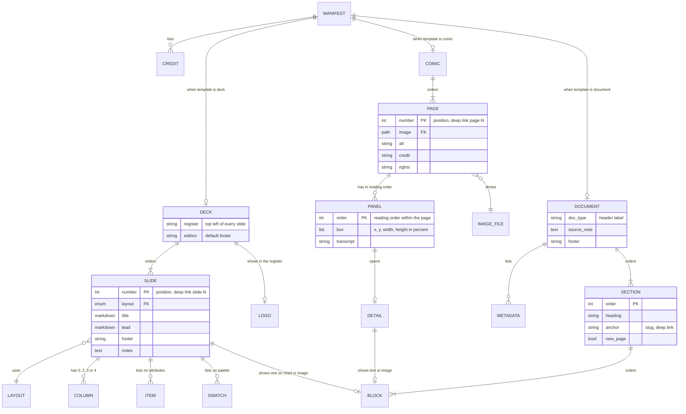
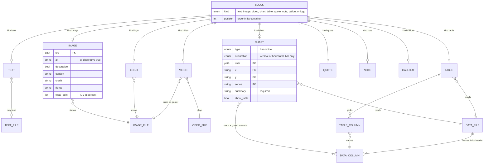
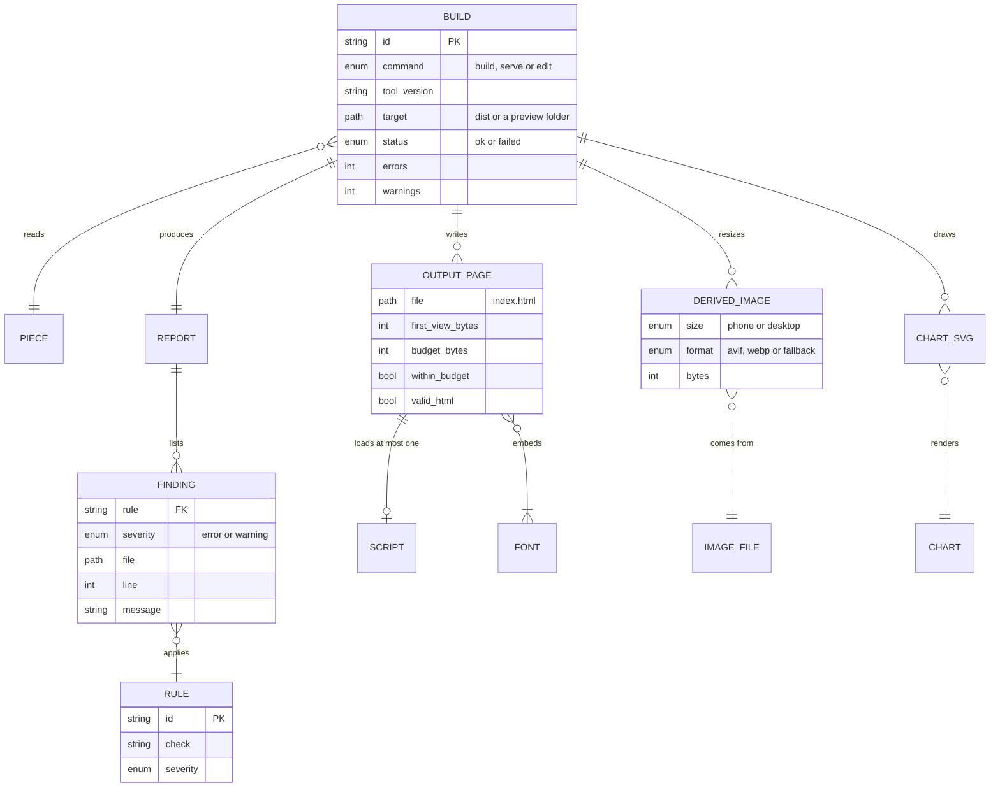
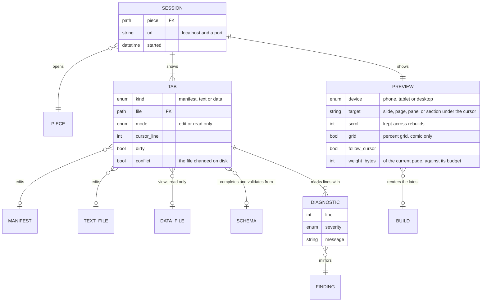
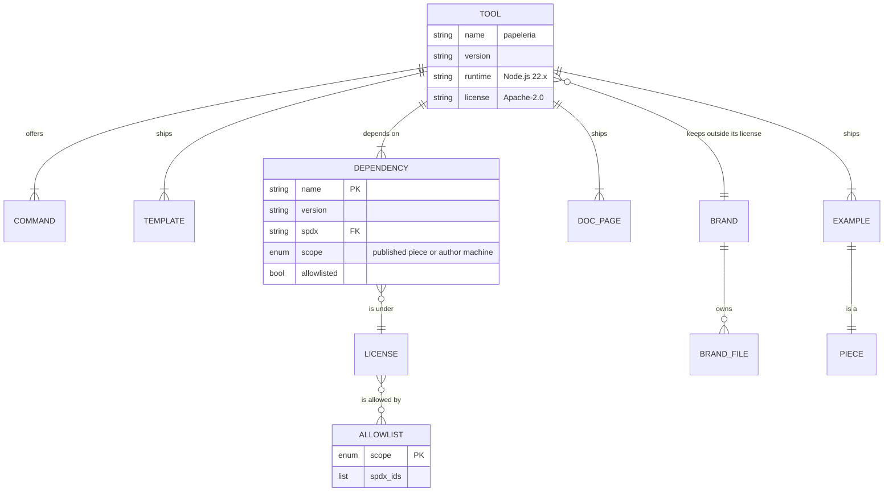
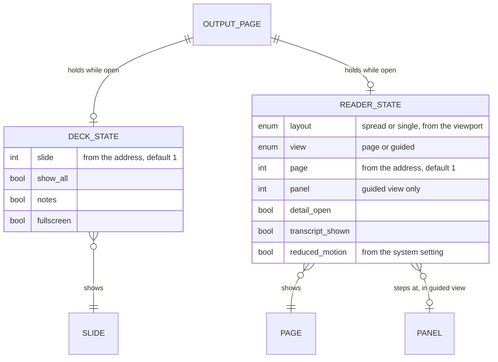

# Papeleria: entity relationship diagram

A piece is a folder. Every entity here is a file, a value inside a file, or something the build or the editor derives from them.

| Status | Date | Owner | Companion to |
| --- | --- | --- | --- |
| 0.3-r1, working specification; implementation unverified | 2026-09-22 | Ross.moda studio | Papeleria PRD draft 0.5 and UX draft 0.2 |

Changes since 0.2: reconciled with the PRD 0.5, the UX document 0.2, the architecture 0.2 and the development plan 0.2. The DOC_PAGE list gains the installation guide; version references are updated. Changes in 0.2 were the theme's breakpoints and motion token, the enumerated UI strings, the preview's follow toggle and weight readout, the tab conflict state, and section 12 on runtime state.

> Revision 1 — 2026-09-22. This is the working specification resulting from the requested readiness fixes. Read `DECISIONS.md`, `IMPLEMENTATION_CONTRACTS.md` and `ACCEPTANCE_MATRIX.md`, in the development record, Dev_Papeleria, which is not public, with it. Existing filenames remain stable; this revision supersedes their earlier draft text. Implementation and release acceptance remain unverified.

## How to read this

- There is no database. Identity comes from paths and positions: a piece is its folder, an asset is its relative path, a slide is its position. Section 09 lists every key.
- The diagrams use crow's foot notation in Mermaid: `||` exactly one, `o|` zero or one, `|{` one or more, `o{` zero or more.
- Entity names are in capitals in the diagrams. Manifest keys are lowercase; a multi-word key uses an underscore, such as `show_table`.
- Each dictionary table gives the field, its type, whether the author must write it, the rule or allowed values, and the PRD section it comes from. "Derived" means the build computes it and the author never writes it.
- The scope is the MVP in PRD draft 0.5. Folio entities (agents, LTI, LMS tracking, more than one theme) are not modeled.

## 01. Overview



The author writes the manifest and the assets. The template and the theme come from the tool. The build reads all of them and writes a `dist/` folder and a report. The editor edits the same files and shows the latest preview build.

## 02. Piece and files

### PIECE

| Field | Type | Required | Rule or values | PRD |
| --- | --- | --- | --- | --- |
| folder | path | yes | One folder per piece. Holds `papeleria.yaml`, `assets/`, and after a build `dist/` | 01 |
| assets | folders | yes | `assets/text`, `assets/data`, `assets/images`, `assets/video`. Empty folders are allowed | 01 |
| dist | folder | derived | Written by `build`, never edited by hand, safe to delete | 01, 03 |

### MANIFEST

| Field | Type | Required | Rule or values | PRD |
| --- | --- | --- | --- | --- |
| path | file | yes | `papeleria.yaml` at the piece root. `papeleria.json` with the same structure is accepted. One of the two, never both | 02 |
| schema | integer | yes | `1` in the MVP, judged by value (`1.0` is 1). The tool refuses a manifest with a schema newer than it knows | 02 |
| template | enum | yes | `deck`, `comic` or `document`. Selects the TEMPLATE and which of DECK, COMIC or DOCUMENT applies | 02 |
| title | Markdown inline | yes | The deck's cover title, the comic's title, or the document's takeaway | 02 |
| language | enum | no | `en` (default) or `es`. Sets the page language and selects the UI strings | 02, 15 |
| status | enum | no | `draft` (default), `review`, `published` or `withheld`. Shown in registers and footers. `published` makes R01 an error. `withheld` builds a preview only and writes nothing to `dist/` | 02, 10 |
| wordmark | string | no | The wordmark text in registers and headers. Default: the theme brand's wordmark text | 13 |
| credits | list of CREDIT | no | Shown on the deck cover, the comic's last page, and in the document's metadata | 02 |

### CREDIT

| Field | Type | Required | Rule or values |
| --- | --- | --- | --- |
| role | string | yes | Free text, such as Author, Art, Letters, Review |
| name | string | yes | |
| position | int | derived | List order |

### TEXT_FILE

| Field | Type | Required | Rule or values | PRD |
| --- | --- | --- | --- | --- |
| path | path | yes | `assets/text/**/*.md`, UTF-8 | 01 |
| content | Markdown | yes | Headings, emphasis, lists, links and footnotes. Raw HTML is escaped as visible text; Markdown image syntax is rejected (IC01) | 08 |

A text field whose value starts with `assets/text/` and ends with `.md` loads this file. Any other value is inline Markdown.

### DATA_FILE

| Field | Type | Required | Rule or values | PRD |
| --- | --- | --- | --- | --- |
| path | path | yes | `assets/data/*.csv`, UTF-8, comma separated, decimal point. The first row is the header | 01 |
| columns | list of DATA_COLUMN | derived | From the header. At least one | 09 |
| rows | int | derived | Data rows. Zero rows is R13 warning for a table, error for a chart (IC03) | |

### DATA_COLUMN

| Field | Type | Required | Rule or values |
| --- | --- | --- | --- |
| name | string | derived | The header text. Unique within its file. Matched exactly by `x`, `y`, `series` and table columns |
| type | enum | derived | `number`, `date` or `text`; exact inference, blank/invalid cells and duplicate chart rows follow IC03 |

### IMAGE_FILE

| Field | Type | Required | Rule or values | PRD |
| --- | --- | --- | --- | --- |
| path | path | yes | `assets/images/**/*.png`, `.jpg`, `.jpeg`, `.webp` or `.svg`. Logos under `assets/images/logos/` | 01 |
| width, height | int | derived | Pixels, read at build. SVG uses its viewBox, rounded to whole pixels; a side under 1 or more than 100,000,000 pixels in all is R09 | |
| bytes | int | derived | | |
| kind | enum | derived | `raster` or `vector` | |

### VIDEO_FILE

| Field | Type | Required | Rule or values | PRD |
| --- | --- | --- | --- | --- |
| path | path | yes | `assets/video/*.mp4` or `.webm` | 01 |
| duration | seconds | derived | Finite, greater than zero and <=15 seconds, measured from the bytes: a WebM file's by music-metadata, an MP4's from its movie header (D92); unknown/corrupt duration fails R16 | 08 |
| bytes | int | derived | | |

## 03. Templates, theme and brand

### TEMPLATE

| Field | Type | Rule or values | PRD |
| --- | --- | --- | --- |
| name | enum | `deck`, `comic` or `document` | 05, 06, 07 |
| copies | string | The kit design it reproduces: the slide system, the Web Comics format, the project report | 05, 06, 07 |
| schema | SCHEMA | One per template | 02 |
| sample | path | The sample manifest that `new` copies | 11 |
| script | SCRIPT or none | deck: the kit deck script. comic: the reader with the StPageFlip 2.0.7. document: none | 03 |
| layouts | list of LAYOUT | Deck only | 05 |

### SCHEMA

| Field | Type | Rule or values |
| --- | --- | --- |
| file | path | `templates/<name>/schema.json` |
| id | URI | `https://papeleria.ross.moda/schema/1/<name>/schema.json`; the shared definitions are `…/schema/1/shared/schema-defs.json`, so a `../shared/schema-defs.json#/$defs/…` reference resolves by URI and by file path alike (D148) |
| draft | string | JSON Schema 2020-12 |
| version | int | The MANIFEST.schema it accepts |
| used_by | | `check` (R09), the editor (completion, hover help, diagnostics), and the docs (the manifest reference is generated from it) |

### LAYOUT (deck)

Every layout takes `title`, `lead`, `footer` and `notes`. The table lists what else it takes.

| name | columns | Also takes | Plate |
| --- | --- | --- | --- |
| cover | 0 | credits, shown from the manifest | dark |
| statement | 0 | nothing | dark |
| closing | 0 | nothing | dark |
| two | 2 | `columns` | light |
| three | 3 | `columns` | light |
| four | 4 | `columns` | light |
| chart | 0 | one `chart` or one `table` block | light |
| image | 0 | one `image` block | light |
| attributes | 0 | `items`, a list of ITEM | light |
| palette | 0 | `swatches`, a list of SWATCH | light |
| type | 0 | nothing; the theme's type samples | light |
| wordmark | 0 | nothing; the theme's mark | light |

### THEME

| Field | Rule or values | PRD |
| --- | --- | --- |
| name | `ross-moda`. The only theme in the MVP; a piece cannot choose | 05 |
| tokens | `tokens.css` | 03 |
| styles | `site.css`, `slides.css`, `print.css` | 03 |
| fonts | Two FONT rows | 12 |
| strings | UI_STRING rows for `en` and `es` | 15 |
| brand | One BRAND | 13 |
| breakpoints | 640, 800 and 900 px from the kit; the reader's spread rule of 900 px wide and 500 px tall | UX 01 |
| motion | `--motion-fast` of 160 ms for normal UI hover; reduced motion disables all UI transitions and uses an instant page swap | UX 01 |

### FONT

| Field | Rule or values |
| --- | --- |
| family | Poppins; Inter |
| role | display; reading and UI |
| weights | Poppins 400, 500, 600; Inter 400 to 700 |
| files | Eight WOFF2 subsets, latin and latin-ext, copied into `dist/` by the build |
| license | SIL Open Font License 1.1 |

### UI_STRING

| Field | Rule or values |
| --- | --- |
| key | The keys enumerated in UX document section 12: `skip`, `previous`, `next`, `slide_of`, `all_shown`, `all_shown_one`, `show_all`, `show_one`, `show_notes`, `hide_notes`, `notes_label`, `notes_heading`, `fullscreen`, `fullscreen_denied`, `print`, `page_of`, `pages_of`, `panel_of`, `guided_view`, `page_view`, `detail`, `close`, `transcript`, `panels_hint`, `panels_hint_one`, `no_js`, `no_js_slides`, `format_comics`, the four `status_` labels, `note_label`, `warning_label`, `doc_type_default`, `empty_cell` and `external_link`: 37 keys. A key ending `_one` after its plural's name is that string's singular, used for a count of exactly one (D130) |
| language | `en` or `es` |
| text | |

Every key exists in both languages (C20).

### BRAND

| Field | Rule or values | PRD |
| --- | --- | --- |
| name | Ross.moda | 13 |
| wordmark_text | `papeleria`, from theme/brand.default.json; owner or manifest override remains configurable | 13 |
| files | BRAND_FILE rows | 13 |
| notice | All rights reserved, outside the code license | 13 |
| rules | `TRADEMARKS.md` | 13 |

### BRAND_FILE

| Field | Rule or values |
| --- | --- |
| path | Owner-exclusive assets in `brand/**`, inventoried by SHA-256; no copied owner hashes in output/examples. Public theme defaults/favicon and client logos are exceptions under D05 (R12) |
| kind | `mark`, `logo`, `wordmark`, `favicon` or `social` |
| rights | All rights reserved |

## 04. Content model



### DECK

| Field | Type | Required | Rule or values | PRD |
| --- | --- | --- | --- | --- |
| register | string | no | Top left of every slide, such as "Brand overview / Review edition" | 05 |
| edition | string | no | The default footer text, such as "Version 1.1.0 / 2026-09-05" | 05 |
| logo | LOGO block | no | Replaces the wordmark text in the register. When absent, the theme wordmark shows | 05, 13 |
| slides | list of SLIDE | yes | At least one, at most 1,000 (IC01) | 05 |

### SLIDE

| Field | Type | Required | Rule or values | PRD |
| --- | --- | --- | --- | --- |
| number | int | derived | Position, starting at 1. Deep link `#slide-N`. Footer right shows "N / total" | 05 |
| layout | enum | yes | A LAYOUT name | 05 |
| title | Markdown inline | yes | A line break is two trailing spaces or a backslash | 05 |
| lead | Markdown inline | no | | 05 |
| footer | string | no | Default DECK.edition | 05 |
| notes | text | no | Speaker notes, inline or a text file | 05 |
| columns | list of COLUMN | by layout | Exactly 2, 3 or 4 for `two`, `three`, `four`; none otherwise (R15) | 05 |
| chart or table | CHART or TABLE block | layout `chart` | Exactly one of the two | 05 |
| image | IMAGE block | layout `image` | | 05 |
| items | list of ITEM | layout `attributes` | At least one; no other layout takes items | 05 |
| swatches | list of SWATCH | layout `palette` | At least one; no other layout takes swatches | 05 |

### COLUMN

| Field | Type | Required | Rule or values |
| --- | --- | --- | --- |
| position | int | derived | 1 to 4 |
| heading | string | yes | |
| text | text | yes | Inline or a text file |

### ITEM

| Field | Type | Required |
| --- | --- | --- |
| label | string | yes |
| text | string | yes |

### SWATCH

| Field | Type | Required | Rule or values |
| --- | --- | --- | --- |
| name | string | yes | Such as "Process cyan" |
| value | hex color | yes | |
| use | string | no | Such as "section rail" |

### COMIC

| Field | Type | Required | Rule or values | PRD |
| --- | --- | --- | --- | --- |
| format | string | no | Default "Web Comics" in `en` and "Web Cómics" in `es`. Shown in the register | 06 |
| pages | list of PAGE | yes | At least one, at most 1,000 (IC01). Reading direction is left to right in the MVP | 06 |

### PAGE

The page carries its image fields directly, because every page has exactly one image.

| Field | Type | Required | Rule or values | PRD |
| --- | --- | --- | --- | --- |
| number | int | derived | Position, starting at 1. Deep link `#page-N` | 06 |
| image | path to IMAGE_FILE | yes | The page art. The original is kept for zoom details | 06 |
| alt | string | yes | R03 | 06 |
| credit | string | no | R06 | 10 |
| rights | string | no | R06 | 10 |
| panels | list of PANEL | no | Zero or more, in reading order | 06 |

### PANEL

| Field | Type | Required | Rule or values | PRD |
| --- | --- | --- | --- | --- |
| order | int | derived | Position within the page. Deep link `#page-N-panel-M` | 06 |
| box | list of 4 numbers | yes | `x`, `y`, `width`, `height` as percent of the page image. x/y 0 to 100; width/height >0; all finite; `x + width` and `y + height` at most 100 (R14) | 06 |
| transcript | string | yes | Read by screen readers in order (R04) | 06 |
| detail | DETAIL | no | Absent: transcript-only button; Enter announces text, no empty dialog | 06 |

### DETAIL

Exactly one of the four keys is present (C10).

| Field | Type | Rule or values | PRD |
| --- | --- | --- | --- |
| zoom | `true` | Pans and zooms into the panel area of the original image | 06 |
| text | text | Inline or a text file | 06 |
| image | IMAGE block | | 06 |
| href | url | With nonempty `label`; allowed navigation schemes/relative targets in IC02 | 06 |
| label | string | The link text; required with `href` | 06 |

### DOCUMENT

| Field | Type | Required | Rule or values | PRD |
| --- | --- | --- | --- | --- |
| doc_type | string | no | The header label, default localized doc_type_default: Document / Documento | 07 |
| metadata | list of METADATA | no | Rendered as the metadata block | 07 |
| sections | list of SECTION | yes | At least one, at most 1,000 (IC01) | 07 |
| source_note | text | no | Small print after the last section | 07 |
| footer | string | no | Footer at each logical sheet end. Default is status; status remains visible with a custom footer. No generated physical N/total | 07 |

### METADATA

| Field | Type | Required | Rule or values |
| --- | --- | --- | --- |
| label | string | yes | Such as Audience, Owner, Period, Version |
| value | string | yes | |
| position | int | derived | |

### SECTION

| Field | Type | Required | Rule or values | PRD |
| --- | --- | --- | --- | --- |
| order | int | derived | | 07 |
| heading | string | yes | | 07 |
| anchor | string | derived | A slug of the heading. Deep link `#slug`; duplicates get `-2`, `-3` | 07 |
| new_page | bool | no | Starts a logical sheet on screen and a new physical page in print; overflow continues naturally (IC08) | 07 |
| blocks | list of BLOCK | yes | At least one, in order | 07 |

## 05. Blocks



A block is written as its kind, with a map of its fields. `text` is written as a plain string, which is its only accepted form (D28). A comic page carries its image fields directly (see PAGE).

```yaml
blocks:
  - text: assets/text/summary.md
  - chart: { type: bar, data: assets/data/hours-by-phase.csv, x: phase, y: hours, summary: Review took the most hours. }
  - table: { data: assets/data/hours-by-phase.csv, columns: [phase, hours] }
  - image: { src: assets/images/pier.jpg, alt: The pier at dawn., credit: J. Ross, rights: Studio photograph }
```

### BLOCK

| Field | Type | Required | Rule or values |
| --- | --- | --- | --- |
| kind | enum | yes | `text`, `image`, `video`, `chart`, `table`, `quote`, `note`, `callout` or `logo` |
| position | int | derived | Order in its container |
| container | | derived | Section: any block. Slide: only layout-specific image/chart/table. Detail: text/image. Comic page carries direct image fields. Video only in document sections |

### TEXT

| Field | Type | Required | Rule or values | PRD |
| --- | --- | --- | --- | --- |
| text | Markdown inline or a TEXT_FILE path | yes | See TEXT_FILE for the path rule | 08 |

### IMAGE

| Field | Type | Required | Rule or values | PRD |
| --- | --- | --- | --- | --- |
| src | path to IMAGE_FILE | yes | | 08 |
| alt | string | one of | Exactly one of `alt` and `decorative: true` (R03) | 08, 10 |
| decorative | `true` | one of | | 08, 10 |
| caption | text | no | | 08 |
| credit | string | no | R06 | 08, 10 |
| rights | string | no | R06 | 10 |
| focal_point | list of 2 numbers | no | `x`, `y` in percent, default 50, 50. Used when a layout crops | 08 |

### VIDEO

Fixed behavior: document sections only; native controls, muted, loop, playsinline, preload=none; starts only after Play, never autoplay. Print uses poster plus alternative (IC04).

| Field | Type | Required | Rule or values | PRD |
| --- | --- | --- | --- | --- |
| src | path to VIDEO_FILE | yes | 15 seconds or less (R16) | 08 |
| poster | path to IMAGE_FILE | yes | Shown before play and in print | 08 |
| alt | string | yes | A text alternative for the loop (R10) | 10 |
| caption | text | no | | 08 |
| credit | string | no | R06 | 08, 10 |
| rights | string | no | R06 | 10 |

### CHART

| Field | Type | Required | Rule or values | PRD |
| --- | --- | --- | --- | --- |
| type | enum | yes | `bar` or `line` | 09 |
| orientation | enum | no | `vertical` (default) or `horizontal`; bar only. A `line` chart must omit the key entirely (D28) | 09 |
| data | path to DATA_FILE | yes | | 09 |
| x | DATA_COLUMN name | yes | R13 | 09 |
| y | DATA_COLUMN name | yes | R13 | 09 |
| series | DATA_COLUMN name | no | One line or bar group per distinct value (R13) | 09 |
| summary | string | yes | R05 | 09, 10 |
| show_table | bool | no | Default `false`. Shows the data as a table beneath the chart | 09 |
| caption | text | no | | 09 |
| source | string | no | A source line under the chart | 09 |

### TABLE

| Field | Type | Required | Rule or values | PRD |
| --- | --- | --- | --- | --- |
| data | path to DATA_FILE | yes | | 08 |
| columns | list of TABLE_COLUMN | no | Default: every column in file order | 08 |
| caption | text | no | | 08 |
| source | string | no | | 08 |

### TABLE_COLUMN

A plain string in `columns` is a field name.

| Field | Type | Required | Rule or values |
| --- | --- | --- | --- |
| field | DATA_COLUMN name | yes | R13 |
| label | string | no | Default: the field name |

### QUOTE, NOTE, CALLOUT, LOGO

| Block | Field | Type | Required | Rule or values | PRD |
| --- | --- | --- | --- | --- | --- |
| quote | text | text | yes | | 08 |
| quote | attribution | string | no | | 08 |
| note | text | text | yes | | 08 |
| note | tone | enum | no | `default` or `warning` | 08 |
| callout | text | text | yes | A pull statement in the display face | 08 |
| logo | src | path to IMAGE_FILE | yes | Under `assets/images/logos/` | 08 |
| logo | alt | string | yes | | 08 |

## 06. Build and checks



### BUILD

| Field | Type | Rule or values | PRD |
| --- | --- | --- | --- |
| id | datetime | | |
| piece | PIECE | | 03 |
| command | enum | `build`, `check`, `serve` or `edit`. Preview/check API overlays all dirty text buffers; build reads saved sources | 03, 04 |
| tool_version | semver | Recorded in the output's head | |
| target | path | `dist/` for `build`; a temporary folder for `serve` and `edit` | 03 |
| status | enum | `ok` or `failed` | 10 |
| output_written, output_reason | derived | Report JSON uses outputWritten/outputReason; withheld/failed/check do not replace dist (IC05) | 03, 10 |
| errors, warnings | int | | 10 |

`dist/` is written only when errors are zero and the status is not `withheld` (C21).

### OUTPUT_PAGE

| Field | Type | Rule or values | PRD |
| --- | --- | --- | --- |
| file | path | `dist/index.html`. One HTML file per piece; slides, comic pages and logical sheets live inside it | 03 |
| first_view_bytes | int | Conservative uncompressed resource bytes under IC04, maximum across reference viewports/fallback scenarios; includes all eight fonts | 12 |
| budget_bytes | int or null | 1,048,576 for deck/document; null for comic first view, with separate 307,200-byte phone-image checks | 12 |
| within_budget | bool | R07; comic enforces phone-image threshold separately, not a total first-view cap | 10 |
| valid_html | bool | R08 | 10 |
| lang | string | From MANIFEST.language | |
| script | SCRIPT or none | | 03 |
| fonts | FONT files | Copied, relative paths | 12 |

### DERIVED_IMAGE

| Field | Type | Rule or values | PRD |
| --- | --- | --- | --- |
| source | IMAGE_FILE | | 08 |
| size | enum | `phone` or `desktop`: 800 and 1600 px, no upscale. IC04 fixes quality/orientation/cache. Restricted SVG is validated then copied | 08 |
| format | enum | `webp` required, `avif` if encoder available; approved SVG unchanged. Source original is a separate zoom resource | 08 |
| bytes | int | Every emitted comic phone format is <=307,200 bytes (R07); SVG uses copied bytes | 12 |
| path | path | Preserved source directory + stem + source extension/hash + target width + output format (IC04) | |

The original is copied only when needed by a zoom detail and loads only on user request.

### CHART_SVG

| Field | Type | Rule or values | PRD |
| --- | --- | --- | --- |
| chart | CHART | | 09 |
| svg | inline SVG | Drawn by D3 at build. No chart runtime ships | 09 |
| table | HTML | Beneath the chart when `show_table` is true | 09 |
| palette | | The neutral ramp; the process family from the third series, with a label | 09 |
| bytes | int | | |

### SCRIPT

| Field | Rule or values | PRD |
| --- | --- | --- |
| name | `deck.js` for a deck; `reader.js` for a comic, including the StPageFlip 2.0.7; none for a document | 03, 05, 06 |
| kind | A classic script, one per page, so the page opens from disk | 03 |
| license | Apache own code; MIT for pinned upstream StPageFlip | 13 |

### REPORT

| Field | Rule or values | PRD |
| --- | --- | --- |
| build | BUILD | 10 |
| findings | FINDING rows | 10 |
| format | Text on the command line. JSON with `check --json`, which the editor reads | 04, 10 |

### FINDING

| Field | Type | Rule or values | PRD |
| --- | --- | --- | --- |
| rule | RULE | | 10 |
| severity | enum | `error` or `warning`. From the rule; R01 depends on status | 10 |
| file | path | | 10 |
| line, column | int or null | 1-based text location; missing-field container location; null for binary/global sources (IC01) | 04, 10 |
| relatedLocation | location or absent | Related manifest/source reference where available | 04, 10 |
| fix | string | Action to resolve the finding | 10 |
| message | string | The same wording on the command line and in the editor | 04 |
| detail | string or null | Largest files, container-location note or other context | 10 |

### RULE catalogue

| id | Check | Severity | PRD |
| --- | --- | --- | --- |
| R01 | A bracketed placeholder is still unfilled | Warning; error when status is `published` | 10 |
| R02 | A referenced file is missing | Error | 10 |
| R03 | An image has neither alt text nor a decorative mark | Error | 10 |
| R04 | A comic panel has no transcript | Error | 10 |
| R05 | A chart has no summary | Error | 10 |
| R06 | An image or video has no credit or rights note | Warning | 10 |
| R07 | A page is over its weight budget, or a comic page image is over 300 KiB at phone width | Error, with the largest files named | 10, 12 |
| R08 | The output fails HTML validation | Error | 10 |
| R09 | A field is unknown or missing against the schema | Error, at its line | 02, 10 |
| R10 | A video has no text alternative | Error | 10 |
| R11 | A dependency's license is outside the allowlist | Error, at release | 13 |
| R12 | An owner-exclusive file hash is copied outside `brand/`; D05 lists allowed public/client assets | Error | 13, A11 |
| R13 | Invalid CSV structure/type/required chart values, missing column, duplicate chart key, or empty data under IC03 | Error except header-only table warning; location under IC01 | 09, 10 |
| R14 | A panel box is nonfinite, has nonpositive width/height, or runs off the page | Error, at its line | 06, 10 |
| R15 | A slide's column count does not match its layout | Error, at its line | 05, 10 |
| R16 | Video duration is zero, unknown, corrupt, nonfinite or >15 seconds | Error | 08 |
| R17 | The manifest's schema is newer than the tool | Error | 02 |

## 07. Editor



### SESSION

| Field | Rule or values | PRD |
| --- | --- | --- |
| piece | The folder given to `edit` | 04 |
| url | `http://127.0.0.1:<port>`, token bootstrap fragment removed into memory; separate preview origin (IC06) | 04 |
| started | | |
| tabs | At least one; the manifest tab opens first | 04 |
| preview | Exactly one | 04 |

### TAB

| Field | Rule or values | PRD |
| --- | --- | --- |
| kind | `manifest`, `text` or `data` | 04 |
| file | The MANIFEST, a TEXT_FILE or a DATA_FILE | 04 |
| mode | `edit` for manifest and text; `read only` table for data | 04 |
| cursor_line | Drives PREVIEW.target for the manifest tab | 04 |
| dirty | Unsaved changes. A save writes the plain file; nothing else is stored | 04 |
| conflict | Content revision differs from base; Reload replaces buffer, Keep mine acknowledges disk revision and retains buffer; next save rechecks | 04 |
| base_revision | SHA-256 of exact loaded bytes, never mtime alone | 04 |
| schema | The template's SCHEMA, manifest tab only | 04 |
| diagnostics | DIAGNOSTIC rows from the latest preview build | 04 |

### PREVIEW

| Field | Rule or values | PRD |
| --- | --- | --- |
| device | `phone`, `tablet` or `desktop` | 04 |
| build | The latest preview BUILD, run about 500 ms after typing stops, within 2 s on the recorded A9 reference machine, debounce included | 04, 12 |
| target | Typed slide/page/panel(page+panel)/section(slug) target from IC06 | 04 |
| request_id, generation_id | Latest request identity; stale results never replace newer preview/diagnostics | 04 |
| scroll | Kept across rebuilds | 04 |
| grid | Comic pieces only: a percent grid over the page and a pointer readout in percent, for measuring panel boxes | 04, 11 |
| follow_cursor | Whether the preview follows the cursor; default on | 04 |
| weight_bytes | The current page's first-view weight after the latest preview build, shown against its budget | 04, 12 |

### DIAGNOSTIC

| Field | Rule or values | PRD |
| --- | --- | --- |
| finding | The FINDING it mirrors | 04 |
| file, line, column, severity, message, fix | Mirrors finding; text diagnostics open correct tab; null locations appear in asset/global list | 04 |

## 08. Tool, examples, docs and licensing



### TOOL

| Field | Rule or values | PRD |
| --- | --- | --- |
| name | papeleria | 15 |
| version | semver | |
| runtime | Node.js 22.x on Mac, Windows and Linux | 15 |
| license | Apache-2.0 | 13 |
| files | `LICENSE`, `NOTICE.md`, `TRADEMARKS.md`, a third-party license list | 11, 13 |

### COMMAND

| name | Arguments | Does | PRD |
| --- | --- | --- | --- |
| new | `<template> <folder>` | Copies a self-contained template sample with every referenced asset; refuses an existing nonempty destination | 11 |
| edit | `<folder>` | Starts a SESSION | 04 |
| build | `<folder>` | Runs the checks and writes `dist/` | 03 |
| serve | `<folder>` | Serves a preview build and reloads on file changes | 11 |
| check | `<folder> [--json]` | Runs the checks and prints the REPORT | 10 |

### EXAMPLE

| name | Template | Contents | PRD |
| --- | --- | --- | --- |
| brand-overview | deck | The kit's 16-slide deck rebuilt from files; must match slide for slide (A4) | 11, 14 |
| starter-deck | deck | Five slides | 11 |
| sample-comic | comic | Eight pages, labeled as a prototype, never presented as published work | 11 |
| hours-report | document | A bar chart, a line chart and a table from CSV | 11 |

### DOC_PAGE

| slug | Covers | PRD |
| --- | --- | --- |
| getting-started | Install, `new`, `edit`, `build`, publish | 11 |
| editor | The split view, tabs, diagnostics, device widths, the panel grid | 11 |
| manifest-reference | Every field, generated from the schemas | 11 |
| text | Markdown in `assets/text`, the path rule, line breaks | 11 |
| data-and-charts | CSV rules, chart types, column mapping, the summary | 11 |
| images-video-rights | Formats, alt text, focal point, credit and rights | 11 |
| comics | Pages, panels, boxes, transcripts, details, guided view | 11 |
| publishing | Copying `dist/` to a static host; the iframe snippet | 11 |
| troubleshooting | Every rule in the RULE catalogue, with its fix | 11 |
| install | Requirements, Node.js and Papeleria on Mac, Windows and Linux, offline and proxy installs, updating, developer setup | 11 |

### DEPENDENCY

| name | Scope | SPDX | Note | PRD |
| --- | --- | --- | --- | --- |
| Kit deck script and CSS | published piece | own | | 13 |
| StPageFlip 2.0.7 | published piece | MIT | | 13 |
| Poppins, Inter | published piece | OFL-1.1 | | 13 |
| Node.js | author machine | MIT | | 13 |
| CodeMirror 6 | author machine | MIT | | 13 |
| codemirror-json-schema | author machine | MIT | Checked on 2026-09-21 | 13 |
| D3 | author machine | ISC | Build time only | 13 |
| yaml | author machine | ISC | To verify | 13 |
| markdown-it | author machine | MIT | | 13 |
| d3-dsv, saxes | author machine | ISC | CSV and restricted SVG parsing | 13 |
| music-metadata, html-validate | author machine | MIT | Required CLI runtime for media/HTML checks | 13 |
| sharp | author machine | Apache-2.0 | The `sharp` package itself is Apache-2.0. Its platform binaries differ: `@img/sharp-libvips-*` declare LGPL-3.0-or-later, the win32 and wasm32 builds declare `Apache-2.0 AND LGPL-3.0-or-later` because they link libvips statically, and the remaining `@img/sharp-<platform>` binaries declare Apache-2.0. See D24 | 13 |

### LICENSE

| spdx | Kind |
| --- | --- |
| MIT, ISC, BSD-2-Clause, BSD-3-Clause, Apache-2.0 | permissive |
| OFL-1.1 | font |
| LGPL-3.0-or-later | weak copyleft; sharp only |

### ALLOWLIST

| scope | Allowed | Enforced by |
| --- | --- | --- |
| published piece | MIT, ISC, BSD-2-Clause, BSD-3-Clause, OFL-1.1 | R11 at release |
| author machine (author runtime) | The above plus Apache-2.0, PSF-2.0, Python-2.0 and 0BSD (D29), and LGPL-3.0-or-later for the named sharp binaries that carry libvips (D24) | R11 at release |
| dev | The permissive set plus Apache-2.0. Deliberately not widened by D29 | R11 at release |

CC0-1.0 is not allowlisted in any scope; `railroad-diagrams@1.0.0` carries an approved package-specific exception under D30. The libvips exception is a named list of fourteen packages, not a name prefix: sharp 0.35 also declares `Apache-2.0 AND LGPL-3.0-or-later` on `@img/sharp-win32-arm64`, `-ia32`, `-x64` and `@img/sharp-wasm32`, which link libvips statically.

## 09. Keys and deep links

| Entity | Key | Deep link |
| --- | --- | --- |
| PIECE | Folder path | |
| MANIFEST | Piece plus the fixed file name | |
| TEXT_FILE, DATA_FILE, IMAGE_FILE, VIDEO_FILE | Path relative to the piece, unique | |
| DATA_COLUMN | Header name, unique within its file | |
| TEMPLATE, LAYOUT, THEME | Name | |
| SLIDE | Position | `#slide-N` |
| PAGE | Position | `#page-N` |
| PANEL | Page position and panel position | `#page-N-panel-M` |
| SECTION | Slug of the heading | `#slug` |
| BLOCK | Container and position | |
| RULE | Id | |
| BUILD | Unique generation ID; timestamp is metadata, not identity | |
| EXAMPLE, DOC_PAGE | Slug | |
| DECK_STATE, READER_STATE | The address fragment; see section 12 | `#slide-N`, `#page-N`, `#page-N-panel-M` |

A deep link to a page or panel opens the reader at that place; the reader updates the link as the reader moves.

## 10. Integrity rules

| id | Rule | Checked by |
| --- | --- | --- |
| C01 | A piece has exactly one manifest, YAML or JSON | R09 |
| C02 | `schema` is integer 1, judged by value (`1.0` is 1); greater values fail R17 alone, before any other check of the text except the manifest size limit; missing/invalid/older fail R09 | R09, R17 |
| C03 | Exactly one of DECK, COMIC, DOCUMENT applies, chosen by `template` | R09 |
| C04 | Every asset path resolves to an allowed local file, with traversal/symlink/type rules in IC02; navigation links are separate | R02, R09 |
| C05 | A text value is a file reference only when it starts with `assets/text/` and ends with `.md`, and such a value must be a well-formed text path (IC02) | R02, R09 |
| C06 | Every image has `alt` with a visible character (IC01) or `decorative: true`, never both | R03 |
| C07 | Every video is a document-section block with `alt` holding a visible character (IC01), a local `poster`, and finite 0 < duration <=15 seconds | R09, R10, R16 |
| C08 | A slide's `columns` count equals its layout's count | R15 |
| C09 | A `chart` layout has exactly one of `chart` or `table` | R09 |
| C10 | A detail has exactly one of `zoom`, `text`, `image`, `href`; `href` needs `label` | R09 |
| C11 | A panel box has four finite coordinates; x/y >=0, width/height >0 and both extents <=100 | R14 |
| C12 | Panels are listed in reading order; the reader and screen readers follow that order | by construction |
| C13 | `x`, `y`, `series` and table columns name columns in the CSV header | R13 |
| C14 | `orientation` is allowed only on bar charts | R09 |
| C15 | Every chart has a `summary` | R05 |
| C16 | A section has a heading and at least one block | R09 |
| C17 | Section anchors are unique within a document | by construction |
| C18 | Every comic page has an image and `alt` | R03, R09 |
| C19 | A comic has at least one page; a deck at least one slide; a document at least one section | R09 |
| C20 | Every UI string exists in `en` and `es` | tool tests |
| C21 | `dist/` is written only with zero errors and a status other than `withheld` | build |
| C22 | Each output page loads at most one classic executable script; document zero, escaped inert JSON excluded | build |
| C23 | Each output page is within its weight budget; each comic page image is 300 KiB or less at phone width | R07 |
| C24 | Automatic resources use relative local URLs and make no third-party request; allowed external anchors require user action | R08, tool tests |
| C25 | Every third-party dependency in a published piece is MIT, ISC, BSD or OFL; own code remains Apache-2.0; on the author machine also Apache-2.0, and LGPL for sharp only | R11 |
| C26 | Owner-exclusive hashes stay under `brand/`; public theme/default favicon and independent client logos are allowed (D05) | R12 |
| C27 | A placeholder in brackets blocks a `published` build | R01 |
| C28 | Unfilled placeholders, missing credits and missing rights notes use IC01 source locations and separate fixes | R01, R06 |

## 11. Historical discrepancies found in PRD 0.2

This table preserves earlier reconciliation history. Revision 1 contracts supersede any earlier behavior stated here.

| Found | PRD 0.2 said | Resolved in 0.3 |
| --- | --- | --- |
| No schema version field | "A versioned schema documents every field", but the manifest had no version | `schema: 1` is a required manifest field; R17 |
| Brand file inside a piece | The manifest example set `logo: assets/images/logos/ross-moda-wordmark-ink.svg`, which A11 forbids outside `brand/` | `logo` is optional and holds the piece's own logo; the theme wordmark shows by default; the example no longer references a brand file |
| Wordmark hard-coded in templates | Section 13 lets a fork remove brand files, but the templates carried the `ross.moda` wordmark text | The wordmark and marks come from the theme's brand settings; `wordmark` can be set per piece |
| Rights field missing | The checks look for "credit or rights note", but blocks had only `credit` | `rights` added to image, video and page |
| Video had no text alternative | Alt text was required for images only | `alt` required on video; R10 |
| Callout undefined | Section 07 offered a callout; the shared blocks table had none | `callout` block added |
| Section too narrow | "A section is a heading with text, a table, a chart, an image, or a callout" allowed one block | A section is a heading followed by one or more blocks |
| Checks table incomplete | Section 02 promised schema errors by line, and section 13 a license allowlist, but neither was a listed check | R09, R11, R12, R13 to R17 added to section 10 |
| Weight budget for documents unstated | Only decks and comics had a budget | Documents share the 1 MB first-view budget |
| Status semantics | `withheld` had no defined behavior | `withheld` builds a preview and writes nothing to `dist/`; a decision row records it |
| Language and controls | "No shared strings" left the reader's controls in English for `es` pieces | `language` selects UI strings; English and Spanish ship; A12 |
| Credits had no field | The creative "supplies credits", but no manifest field existed | `credits` list at piece level |
| Chart orientation unstated | Bar charts are "vertical and horizontal" with no field | `orientation` field |
| Block naming inconsistent | The blocks table used `src`; the page example used `image` | Blocks use `src`; a page carries its image fields directly; the rule is stated in section 08 |
| Panel grid helper placement | A docs helper measured panels, although 0.2 added a preview | The percent grid lives in the editor preview |
| Editor needs machine-readable findings | "The same wording as the command line" implied a shared report format | `check --json` |

## 12. Runtime state

The deck and the comic reader keep state only in memory and in the address fragment. Nothing is written to storage, and a link reproduces the reader's place.



### DECK_STATE

| Field | Rule or values | Source |
| --- | --- | --- |
| slide | The current slide, written to `#slide-N` on every change | UX 05 |
| show_all | Every slide visible; the status reads "All N slides shown.", or "1 slide shown." for a deck of one slide (D130) | UX 05 |
| notes | Speaker notes visible | UX 05 |
| fullscreen | The deck fills the screen; refusal leaves the state false and says so | UX 05 |

### READER_STATE

| Field | Rule or values | Source |
| --- | --- | --- |
| layout | `spread` when the viewport is at least 900 px wide and 500 px tall and each page can be 320 px wide; otherwise `single`. Recomputed on resize; retain the logical page/panel and display its containing spread (IC07) | UX 06 |
| view | `page` or `guided`; guided is opt-in and Escape returns to page | UX 06 |
| page | The current page, written to `#page-N` | UX 06 |
| panel | The current panel in guided view, written to `#page-N-panel-M` | UX 06 |
| detail_open | A dialog is open; focus is trapped and the page behind is inert | UX 06 |
| transcript_shown | The transcript list under the page is open; kept across turns | UX 06 |
| reduced_motion | From `prefers-reduced-motion`; a turn is an instant swap when true | UX 01, 06 |

Loaded images are not state: the reader keeps the current, previous and next spreads' images and drops the others' `src` and `srcset` after enhancement initializes, keeping their size so the layout never shifts.

## Next action

Implement all three schemas in M1 from sections 02–05 and IC01–IC04. The rule catalogue maps to explicit positive/negative fixtures in ACCEPTANCE_MATRIX.md. Runtime/save/output fields use the IC05–IC07 wire contracts; release acceptance remains pending.

Basis: Papeleria PRD drafts 0.2 to 0.5; the Ross.moda branding sensibilities v1.1.0 (the deck markup, the professional templates, the studio content template); the Folio PRD of 2026-09-21. Not a signed approval.
